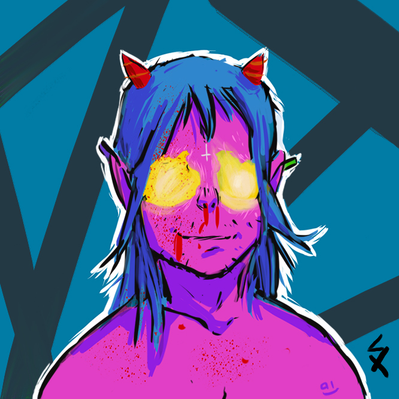

# S.H.A.C.K.E.R. NFT - Interactive NFT Platform

Une plateforme avancée pour créer, gérer et mettre à jour des NFTs interactifs de la collection S.H.A.C.K.E.R. sur la blockchain Ethereum.

## Présentation

Ce projet permet de créer des NFTs qui contiennent non seulement une image, mais aussi une expérience interactive complète (mini-jeu, animations, etc.) directement intégrée dans le NFT. La plateforme permet également de garder le contrôle sur les NFTs même après leur vente, permettant la mise à jour des métadonnées, l'organisation d'événements live, et l'évolution du contenu interactif au fil du temps.

## Fonctionnalités

- ✅ NFTs interactifs avec mini-jeux et animations
- ✅ Smart contract déployé sur Sepolia testnet
- ✅ Interface d'administration pour gérer les NFTs
- ✅ Stockage IPFS via NFT.Storage
- ✅ Mise à jour des métadonnées via CSV
- ✅ Système d'événements live
- ✅ Expérience utilisateur complète

## Technologies utilisées

- **Frontend**: React, TypeScript, Tailwind CSS
- **Backend**: Node.js, Express
- **Blockchain**: Ethereum, Hardhat, ethers.js
- **Stockage décentralisé**: IPFS, NFT.Storage
- **Base de données**: PostgreSQL, Drizzle ORM

## Démarrage rapide

1. Clonez le repository
2. Installez les dépendances: `npm install`
3. Configurez les variables d'environnement (copiez `.env.example` vers `.env` et remplissez les valeurs)
4. Démarrez le serveur: `npm run dev`
5. Accédez à l'interface d'administration: http://localhost:5000/admin-nft.html

## Documentation détaillée

Pour une documentation complète, consultez le fichier [PROJECT_DOCUMENTATION.md](PROJECT_DOCUMENTATION.md).

## Licence

Ce projet est sous licence MIT. Voir le fichier LICENSE pour plus d'informations.